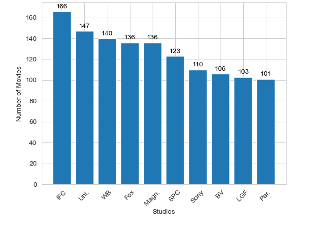

# Moringa school Project One Phase 1

## Overview

I will be working on a project where I will use exploratory data analysis to generate insights for a business stakeholder. The business problem is that Microsoft wants to create a new movie studio, but they lack knowledge in creating movies. My task is to explore the types of films that are currently performing well at the box office and provide actionable insights to the head of Microsoft's new movie studio. The goal is to help them decide what types of films to create and ensure the success of their new venture.

## Business problem 
The business problem in this project is that Microsoft wants to enter the movie industry by creating a new movie studio, but they don't have any prior knowledge or experience in this field. The real-world problem is the lack of understanding of the current movie market and the types of films that are successful at the box office. The stakeholder in this case is the head of Microsoft's new movie studio who needs to make informed decisions about the type of films to create that would appeal to the audience and generate revenue.

## Objective
To use exploratory data analysis to identify the most successful movie genres at the box office and provide actionable insights to the head of Microsoft's new movie studio to help guide their decision-making process when creating new films.

## Business understnding
The project aims to explore what types of films are currently doing the best at the box office and translate those findings into actionable insights that can help the head of Microsoft's new movie studio in deciding what types of films to create. By analyzing the data, the project can provide insights into the popular genres, themes, and characteristics of successful films in the current market. This information can help the stakeholder make informed decisions and create films that would resonate with the audience and generate revenue for the company.

The stakeholders who could use this project include the head of Microsoft's new movie studio, the creative team responsible for creating the films, and the marketing team responsible for promoting the films. The insights generated from the analysis could be used to inform the creative direction of the studio's films and help the marketing team in identifying target audiences and designing effective promotional strategies.

In conclusion, this project's value lies in providing insights into the current movie market that can help Microsoft's new movie studio make informed decisions about the types of films to create. By understanding what types of films are currently successful, the studio can create films that appeal to the audience and generate revenue for the company.
## Datasets
We will be working with the following datasets:

* Box Office Mojo (bom.movie_gross.csv)
* Rotten Tomatoes (rt.movie_info.tsv)
* TheMovieDB (tmdb.movies.csv)
* The Numbers (tn.movie_budgets.csv)

### NUMBER OF MOVIE RELEASES BY MONTH

Most movies were released in January and October as compared to February and July.

### TOP 10 MOVIES BY GROSS PROFIT

Avatar generated the highest gross profit among all movies analyzed in the dataset.

### Number of movies produced by top ten studioa

IFC emerged as the leading film production company in the analyzed dataset, producing a high number of movies compared to the other films

### Domestic and foreign gross income over time

The dominance of English as the original language in the movie dataset, accounting for 87.6% of all films, suggests that English-speaking audiences are a significant target audience for the movie industry, which could be attributed to factors such as the global influence of Hollywood and the predominance of the English language in international business and media.

### Top 5 movie genres

Our analysis of the movie dataset revealed that drama is the most popular genre in terms of the number of movies produced, with over 38% of all movies falling under this category

### Distribution of Movie Original Language

The dominance of English as the original language in the movie dataset, accounting for 87.6% of all films, suggests that English-speaking audiences are a significant target audience for the movie industry, which could be attributed to factors such as the global influence of Hollywood and the predominance of the English language in international business and media.

## Recommendations
Below are some of the recommendations for the microsoft company:

Plan to release movies in January, October, and April as these months seem to have a higher chance of success based on the popularity of released movies in the dataset.

Consider partnering with IFC and Universal Studios as they have produced more movies than other studios in the dataset.

Take note that foreign gross is always higher than domestic gross, so consider targeting international markets as well when promoting and marketing movies.

If looking for a blockbuster movie with high gross profits, consider producing movies like Avatar, Star Wars Ep.VII: The Force Awakens, and Titanic, which have a history of performing well in terms of gross profit.

Consider producing movies in English as it is the most common language in the dataset and may have a wider audience.

Produce more movies in the Drama and Comedy genres as they are the most popular.# Phase_1_Project
